# Hi, I'm Amr

### Backend Developer • DevOps Engineer in Progress

I build **backend systems, APIs, and infrastructure**, with a focus on scalable and maintainable systems.

Currently working with **TypeScript, NestJS, Docker, Kubernetes, Linux, and AWS**.

  

###  GitHub Metrics

  

---

###  Connect

[LinkedIn](https://linkedin.com/in/amr-mahmoud-) • [Portfolio](https://amr-mahmoud.me)

---

_"Build it. Break it. Understand it. Automate it."_
